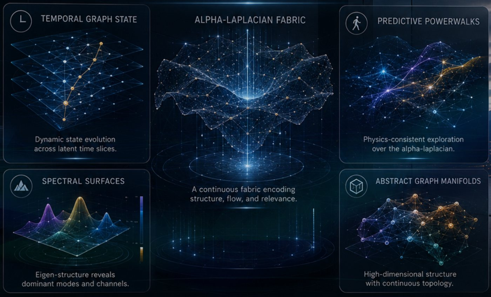
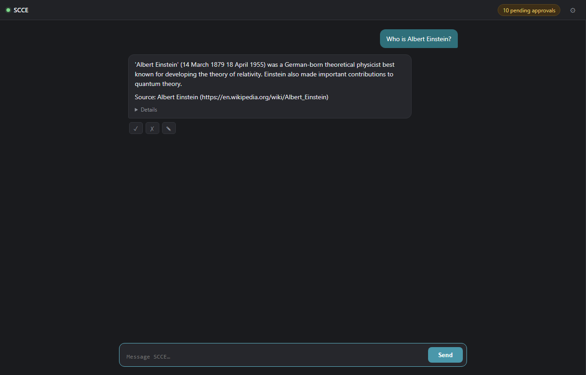
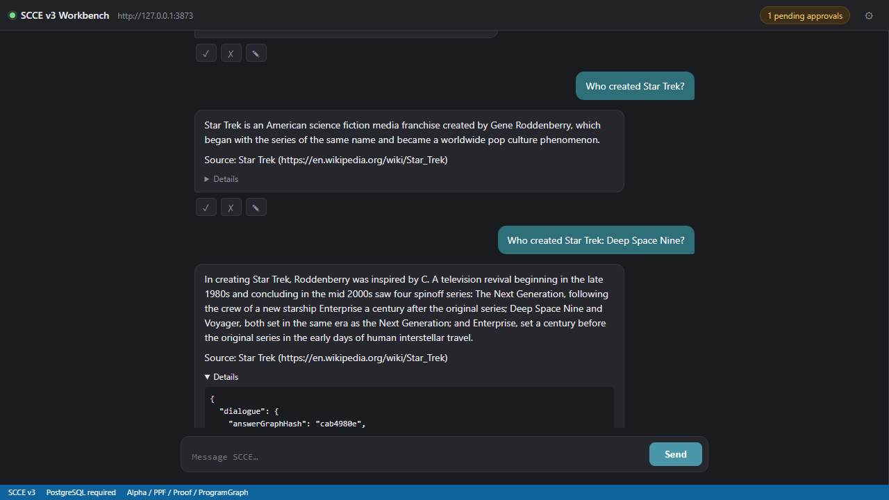
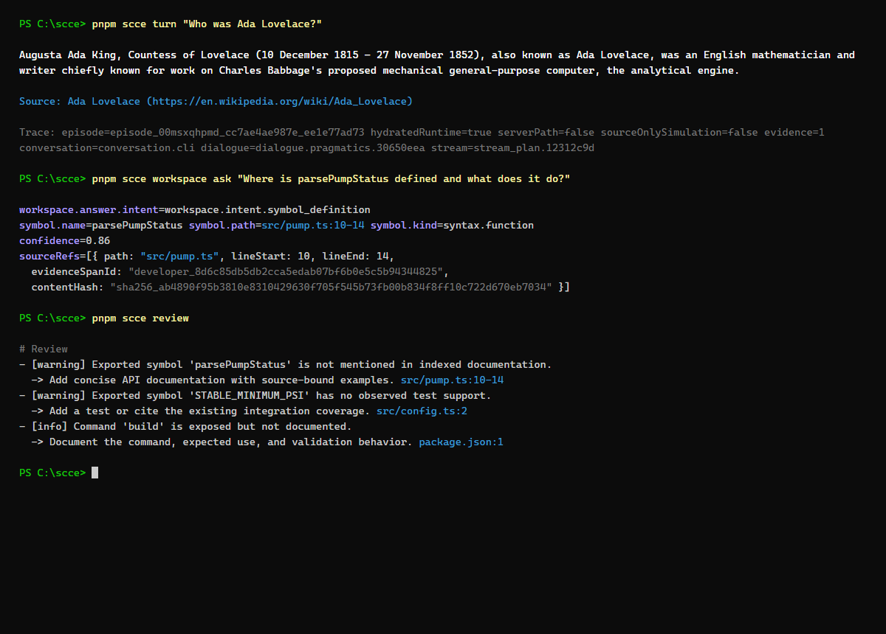
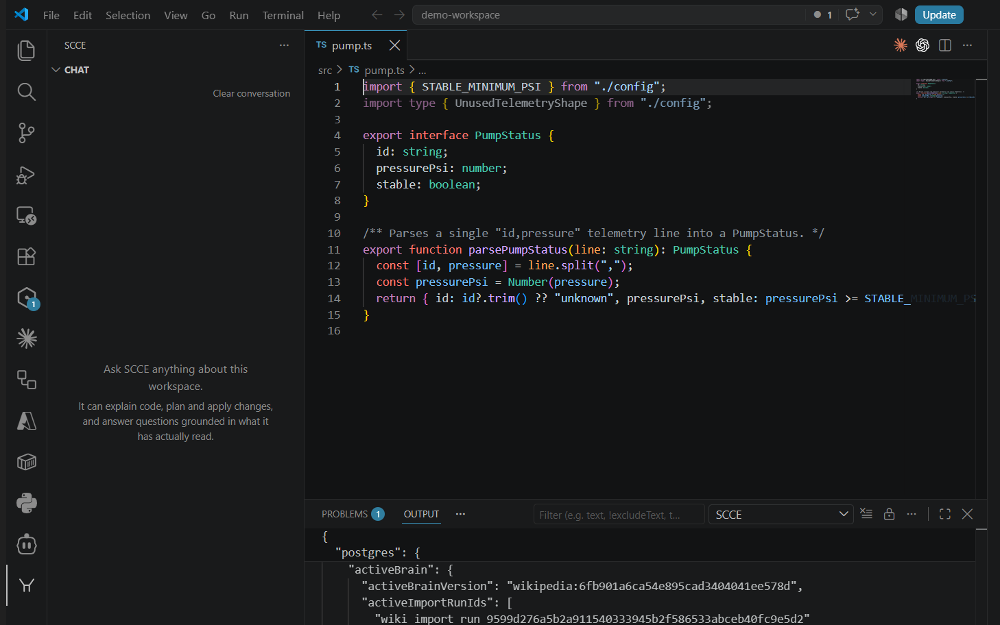

# SCCE — Self-Contained Cognitive Engine

**GO WEIGHTLESS.**

Sovereign intelligence on ordinary hardware.

SCCE is a self-contained cognitive engine that ingests evidence, builds durable knowledge, reasons, plans, acts, and learns — without a foundation-model runtime.

No LLM inference. No vector-database RAG loop. No GPU cluster. No cloud dependency.



SCCE compiles evidence, language, reasoning, and learned skills into sparse, inspectable cognitive structures. At runtime, it activates only the structures relevant to the task.

**CPU-native · Local · Persistent**

**Implemented · Benchmarked · Operational**

SCCE is an implemented cognitive runtime, not a proposal, model wrapper, or retrieval layer. This repository contains its evidence-preserving ingestion, persistent cognitive graph, reasoning, planning, learned language, durable memory, application surfaces, and sealed evaluation harness.

## Current verified status

Measured against this repository's own gates, on a live PostgreSQL-backed
runtime with a real ingested Wikipedia corpus (2026-08-17):

- **Test suite**: 298 test files / 1,989 tests passing across the kernel,
  server, and adapter packages, including the live-database test files run
  against a real PostgreSQL instance.
- **Sealed evaluation rehearsal**: 6/6 on the objective (required-string
  + abstention) scorer on the sealed 4-document, 6-question harness,
  versus 4/6 for the independent BM25 reference baseline. Honest scope
  limits, stated plainly: the objective scorer has no coherence axis, and
  a human read of the raw answers
  (`tools/sealed-eval/artifacts/run-20260817b/out/raw-answers.jsonl`)
  shows 4 of 6 contain stitched or truncated sentences; citations are
  byte-`sha256`-verified **where present** — 4 of 6 answers carry them,
  while 2 of 6 drew on a source outside the sealed manifest and correctly
  failed closed with a recorded citation omission instead of fabricating
  one (which also means SCCE's retrieval was not constrained to the
  sealed corpus the way the BM25 baseline was). Single-operator
  rehearsal scope; the independent public-review protocol in
  [`docs/PUBLIC_REVIEW_CONTRACT.md`](docs/PUBLIC_REVIEW_CONTRACT.md) has
  not yet been executed.
- **Live rehearsals**: the PostgreSQL schema/activation rehearsal and the
  end-to-end adapter rehearsal (ingest → promote → live turn → exact
  byte-verified citation) both pass against a real database.
- **Enumeration-shaped questions**: "list the main characters of X"-style
  requests return a contiguous, byte-verifiable multi-sentence excerpt
  (learned response-form budget; no keyword lists), verified live against
  the hydrated Wikipedia brain — the answer window is constructed in the
  same normalization space the source-excerpt verifier compares in, so
  verification holds by construction.
- **Post-training query latency**: whole-novel corpus training exposed a
  planner pathology (correlated `EXISTS` over a multi-GB observations
  table seq-scanned once per candidate profile); replaced with a
  recursive index skip scan — measured live at 53ms versus 3.5 minutes
  for the same result, turn-path profile query from stuck (25+ minutes)
  to ~1s cold.

## A third architecture for AI

Closed-weight AI rents intelligence from somebody else's data center.

Open-weight AI lets you host the weights yourself — but still requires billions of parameters, accelerator infrastructure, and repeated dense inference.

SCCE removes foundation-model weights from the runtime architecture entirely.

| Dense AI | SCCE |
|---|---|
| Intelligence encoded in opaque model weights | Intelligence compiled into inspectable graph structures |
| Dense model evaluated repeatedly | Bounded, task-local activation |
| Knowledge blended into parameters | Evidence retains identity, time, and provenance |
| Context disappears between sessions | Knowledge, skills, and outcomes persist |
| Accelerator-centered inference | CPU-native execution |
| Provider or model controls the intelligence | The operator owns the runtime and its memory |

## What SCCE does

**INGEST → STRUCTURE → ACTIVATE → REASON → PLAN → ACT → LEARN**

- Ingests documents, source code, and spreadsheets while preserving exact source identity, coordinates, and timestamps.
- Compiles observations into a directed cognitive graph instead of embedding text into a retrieval index.
- Activates a bounded, task-relevant graph field instead of evaluating a dense model for every generated token.
- Constructs answers with explicit evidence, contradiction, and confidence traces.
- Separates what may be claimed from how it is expressed.
- Applies reviewed code patches through a loopback-only VS Code integration backed by exact-byte workspace snapshots.
- Preserves learned knowledge and outcomes in operator-controlled storage.

## Evidence is part of the answer

SCCE does not treat provenance as a citation added after generation.

Every admitted observation retains:

- where it came from;
- when it was observed;
- the exact source span that supports it;
- how it entered the graph;
- which reasoning path activated it;
- what contradictions or uncertainty remain.

When the available evidence cannot support an answer, SCCE can qualify the result, request more information, or decline to invent one.

## The cognitive pipeline

```text
Source material
      |
Evidence-preserving ingestion
      |
Entities, relations, events, and constructions
      |
Persistent cognitive graph
      |
Task-conditioned local activation
      |
Reasoning, planning, and capability selection
      |
Evidence-bound answer or proposed action
      |
Outcome recording and continued learning
```

The reasoning layer determines what the evidence licenses SCCE to say or do. A separate realization layer determines how to express it. Surface fluency cannot authorize unsupported facts.

For the complete technical design, see [`docs/ARCHITECTURE.md`](docs/ARCHITECTURE.md).

## One engine, multiple surfaces

SCCE is exposed through:

- a local HTTP API and a chat-first workbench in the browser;
- a chat sidebar in VS Code, with reviewed code-change requests reachable from the same conversation;
- a command-line interface;
- repository and trace inspection through `scce-dev-mcp`;
- PostgreSQL-backed persistent cognitive state.

The interfaces do not contain separate intelligence. They operate against the same local cognitive engine.

### See it running

All captures below are the real runtime answering against its live
PostgreSQL brain — nothing staged, no mock responses.

- [30-second demo video](docs/media/scce-demo-30s.mp4) — the workbench
  answering questions with source-cited answers and expanding the live
  evidence trace (recorded in real time, played back at 6.4×).
- 
- 
- 
- 

## Run SCCE

Requirements: Node.js 24.18+ (24.x), pnpm 10, and PostgreSQL.

Install and validate:

```powershell
pnpm install
pnpm validate
```

Configure the database:

```powershell
$env:SCCE_DATABASE_URL="postgresql://<user>:<password>@<host>:<port>/<database>"
pnpm scce db migrate
pnpm scce db verify
```

Start the server or CLI:

```powershell
pnpm server
pnpm scce
```

Full setup, configuration, rehearsal commands, and VS Code packaging are documented in [`docs/USER_GUIDE.md`](docs/USER_GUIDE.md).

## Repository map

```text
packages/kernel         cognition, graph, evidence, planning, and language
packages/adapters-node  PostgreSQL, files, documents, and spreadsheet ingestion
packages/server         HTTP API and workbench server
packages/cli            command-line interface
packages/ui             workbench-facing models and surfaces
packages/vscode         loopback-only VS Code integration
tools/scce-dev-mcp      repository and trace inspection
docs                    architecture, guides, and normative contracts
```

## Documentation

- [`docs/ARCHITECTURE.md`](docs/ARCHITECTURE.md) — cognitive architecture and runtime pipeline
- [`docs/USER_GUIDE.md`](docs/USER_GUIDE.md) — installation and operation
- [`docs/API_SURFACE.md`](docs/API_SURFACE.md) — HTTP API
- [`docs/README.md`](docs/README.md) — complete documentation index
- [`SECURITY.md`](SECURITY.md) — security posture and vulnerability reporting

## License

SCCE is source-available for inspection under a proprietary license. It is not open source, and no license to use, copy, or redistribute the software is granted except as stated in [`LICENSE`](LICENSE) and [`NOTICE`](NOTICE).

---

**Own the runtime. Keep the learning.**

SCCE — the weightless cognitive engine.
